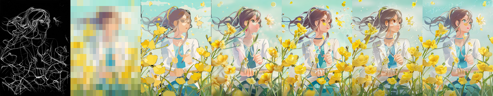
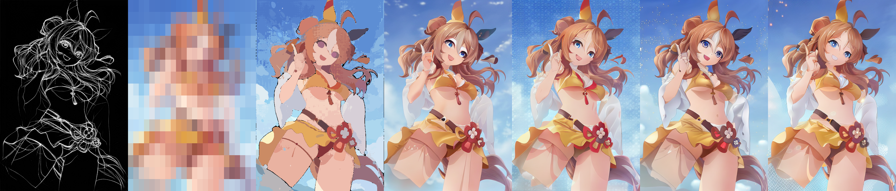
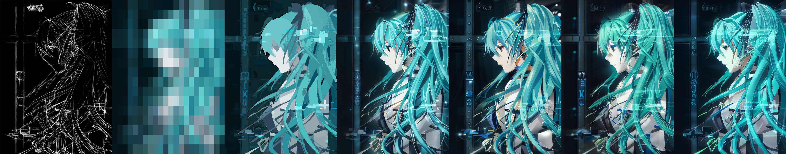
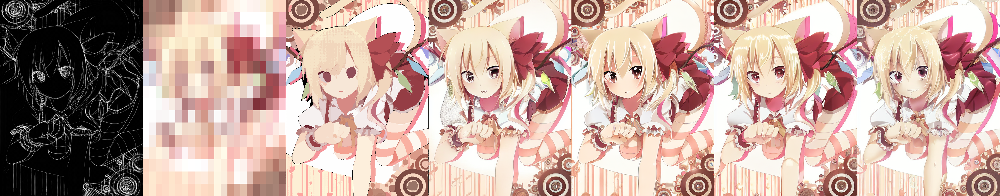
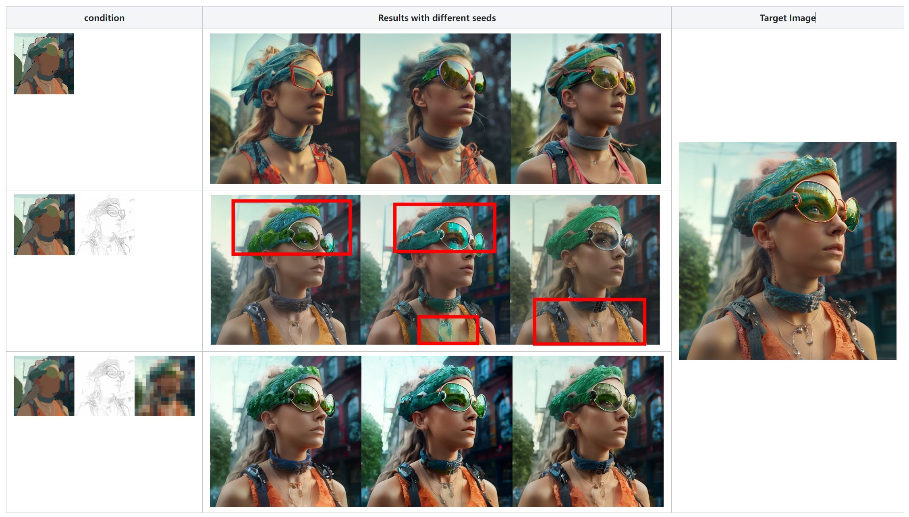
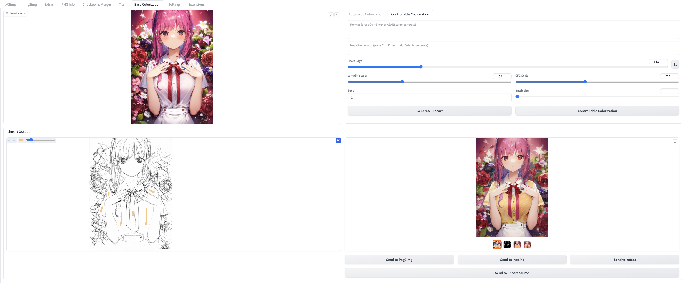

# A simple extension of Controlnet for color condition

##  Updates

- **`2023/05/11`**: We release new checkpoints for sketch control from [controlnetv1.1](https://github.com/lllyasviel/ControlNet-v1-1-nightly). We utilize the SAM 
palette as the latent input in an image2image manner and also implemented the rectangular palette via controlnet. 

- **`2023/04/17`**: We release a simple code for color controlnet. Our team has incorporated either rectangular or SAM palette to effectively control the color.

## Features
We provide two color condition inputs:
1. Rectangular downsample color palette.

2. Segmentation mask from [SAM](https://segment-anything.com/demo)

Download the pretrained [weights](https://drive.google.com/drive/folders/1HmOfefmXpYYOBBi9wuDoIGpiWxjFXMw7?usp=sharing).

**Training code**: our model is compatible with the training code of [diffusers controlnet](https://github.com/huggingface/diffusers/tree/main/examples/controlnet).

Version 1: Run __infer_palette.py__ to reproduce the results.

Version 2 (recommended):  Run __infer_palette_img2img.py__ to reproduce the results.

## Results 

The first cell pertains to the sketch condition, while the subsequent cell represents the rectangular palette condition. The third cell corresponds to the SAM palette. The final four cells showcase four distinct images that were generated using varying seeds.

## What is the rationale behind utilizing an additional rectangular palette?

When utilizing the SAM palette in an image-to-image capacity, it is likely that the results obtained will be low-contrast, as the color of a mask is limited to a single value. However, the implementation of a rectangular palette can serve to address this limitation by introducing color variations into the denoising process. An ablation study example is presented below to further illustrate this concept.

## Edit Color

With this model, we can easily edit the color of an image by simply scribbling.

