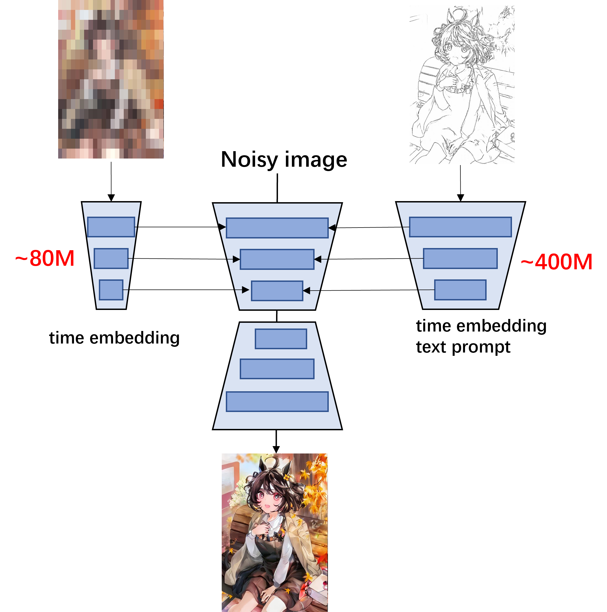
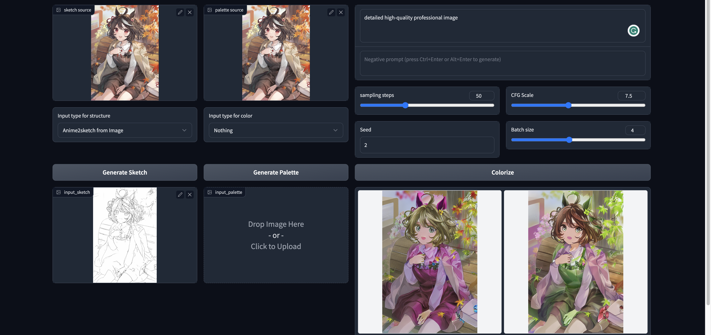
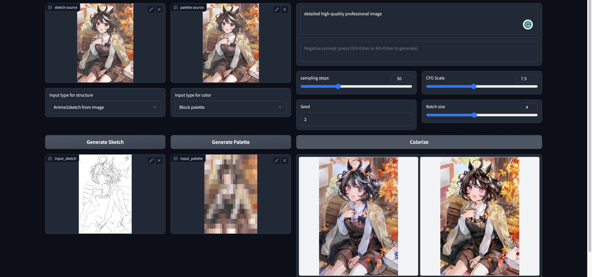
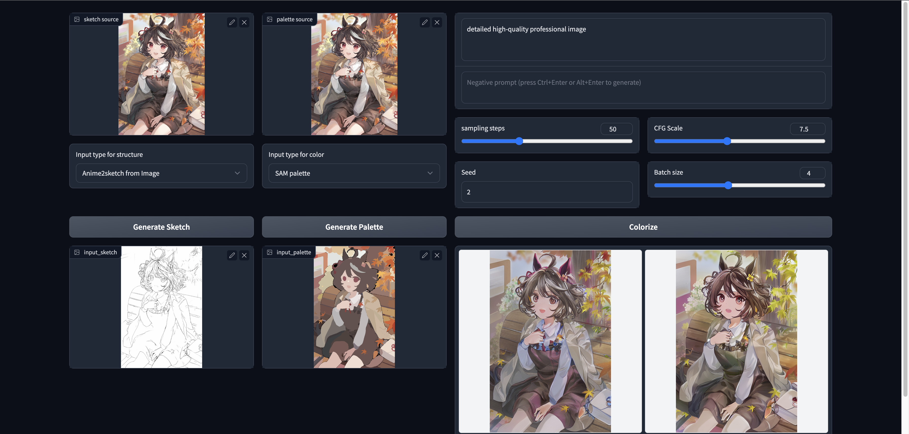

# A simple extension of Controlnet for color condition

Sketch or line art colorization is a research field with significant market demand. 

## Features
We provide two color condition inputs:
1. Rectangular downsample color palette.

2. Segmentation mask from [SAM](https://segment-anything.com/demo)

## Framework

Generate sketch with [anime2sketch](https://github.com/Mukosame/Anime2Sketch)

Download the pretrained [weights](https://drive.google.com/drive/folders/1HmOfefmXpYYOBBi9wuDoIGpiWxjFXMw7?usp=sharing).

Run __infer_palette.py__ to reproduce the results.

## Results 

The first cell is sketch condition. The second cell is a color condition (black means no condition). The last four cells are four pictures generated with different seeds.

## Demo

