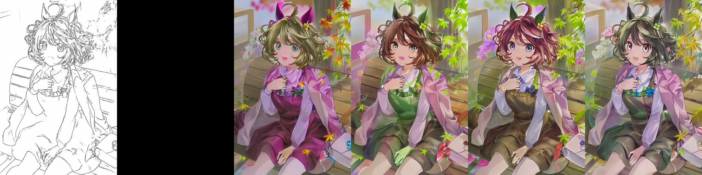
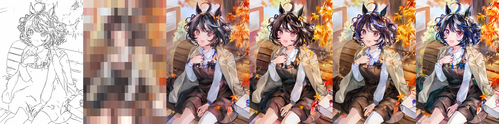
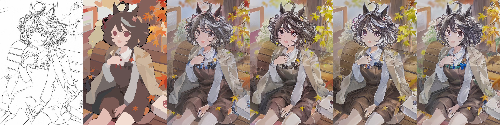
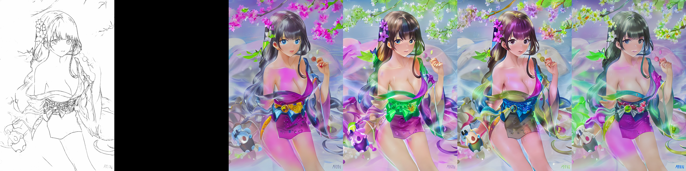
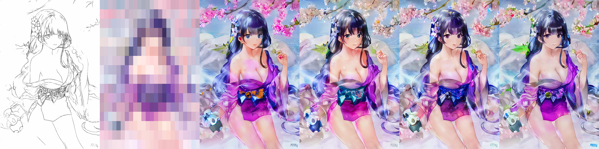

## A simple extension of Controlnet for color condition

We provide two color condition inputs:
1. Rectangular downsample color palette.

2. Segmentation mask from [SAM](https://segment-anything.com/demo)

We generate sketch with [anime2sketch](https://github.com/Mukosame/Anime2Sketch)

Download the pretrained [weights]().

Run __infer_palette.py__ to reproduce the results.

The first cell is sketch condition. The second cell is a color condition (black means no condition). The last four cells are four pictures generated with different seeds.

